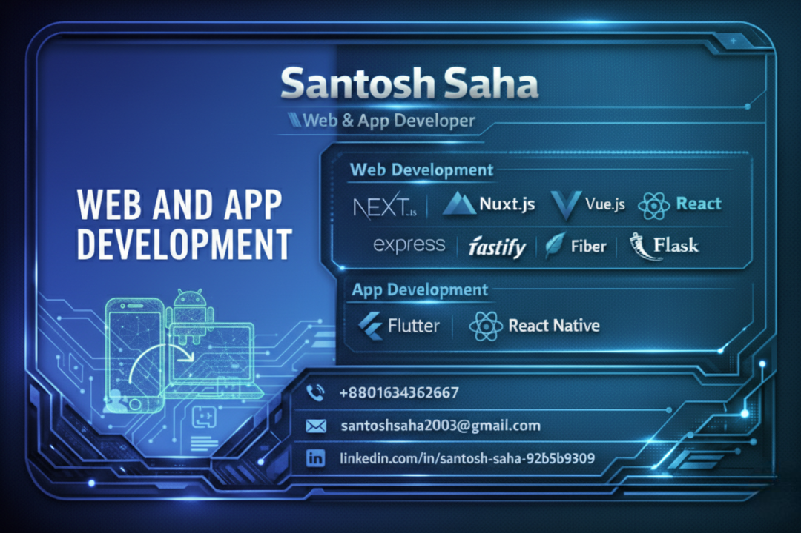

## 👋 Hi, I’m a Professional App & Web Developer

🎓 **CSE Student at SUST, Sylhet**
📱 **Mobile • Web • Backend • Full-Stack**

I build **scalable, high-performance mobile and web applications** with clean architecture, modern UI, and production-ready backend systems.

---

## 🚀 Core Skills

### 📱 Mobile Development

* **React Native (CLI)** – TypeScript, JavaScript
* **Android (Kotlin)** – Jetpack Compose
* **Flutter** – Dart, Widgets, State Management
* Responsive UI & Material Design
* REST API & Real-time Data Integration
* Offline Storage (AsyncStorage)
* Permissions Handling
* Animations (Lottie, Reanimated)
* Performance Optimization

---

### 🌐 Frontend Development

* **React 19**
* **Next.js / Nuxt.js**
* **Vue.js**
* HTML5, SVGs, Gradients
* **Tailwind CSS**
* Fully Responsive UI

---

### 🧠 Backend & APIs

* **Fastify.js**
* **Flask (Python)**
* **Fiber (Go)**
* **SlimPHP**
* **ASP.NET Core**
* **Supabase**
* RESTful API Design

---

### 🔗 Full-Stack

* **Next.js**
* **Nuxt.js**
* End-to-end app architecture & deployment

---

### 🏗 Architecture & Code Quality

* MVVM Architecture
* SOLID Principles
* Clean Code Practices
* Unit Testing (Jest)
* ESLint & Prettier

---

### 🛠 Tools & Platforms

* Git & GitHub
* Android Studio
* Node.js
* Metro Bundler

---

### 🗄 Databases

* **MongoDB**
* **MySQL**
* **PostgreSQL**

---

## 📫 Connect With Me

* 🌐 Portfolio:[My portfolio](https://portfolio-qx6l.onrender.com/)
* 💼 LinkedIn:[My LinkedIn Profile](https://bd.linkedin.com/in/santosh-saha-92b5b9309)
* 📧 Email: *santoshsaha2003@gmail.com*

---

